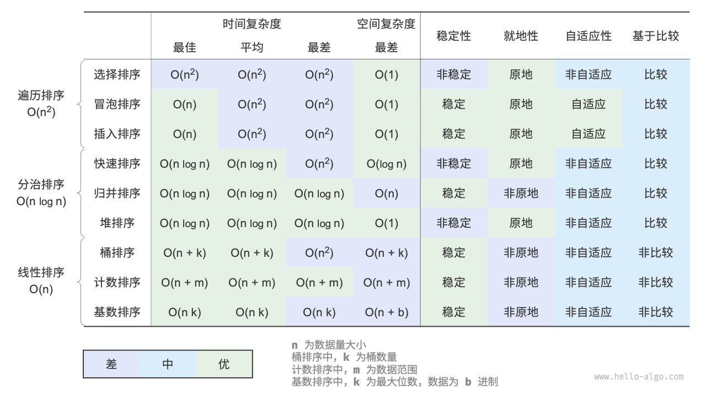

# JavaScript 排序算法实现

本文包含了 8 种常见排序算法的 JavaScript 实现，每种算法都附带了其时间复杂度、空间复杂度和稳定性分析。

## 可视化网站

[VisuAlgo 排序算法可视化](https://visualgo.net/zh/sorting "排序算法的动态可视化教程")

## 工具函数

首先，我们定义一个用于交换数组元素的工具函数：

```javascript
function swap(arr, i, j) {
  [arr[i], arr[j]] = [arr[j], arr[i]];
}
```

## 快速排序 (Quick Sort)

- 时间复杂度: 平均 O(nlogn)，最坏 O(n²)
- 空间复杂度: O(logn)
- 稳定性: 不稳定

```javascript
function quickSort(arr, left = 0, right = arr.length - 1) {
  if (left < right) {
    const pivot = partition(arr, left, right);
    quickSort(arr, left, pivot - 1);
    quickSort(arr, pivot + 1, right);
  }
  return arr;
}

function partition(arr, left, right) {
  const pivot = arr[right];
  let i = left - 1;

  for (let j = left; j < right; j++) {
    if (arr[j] < pivot) {
      i++;
      swap(arr, i, j);
    }
  }
  swap(arr, i + 1, right);
  return i + 1;
}
```

## 冒泡排序 (Bubble Sort)

- 时间复杂度: O(n²)
- 空间复杂度: O(1)
- 稳定性: 稳定

```javascript
function bubbleSort(arr) {
  const n = arr.length;
  for (let i = 0; i < n - 1; i++) {
    let swapped = false;
    for (let j = 0; j < n - 1 - i; j++) {
      if (arr[j] > arr[j + 1]) {
        swap(arr, j, j + 1);
        swapped = true;
      }
    }
    if (!swapped) break; // 如果没有交换，说明已经排序完成
  }
  return arr;
}
```

## 插入排序 (Insertion Sort)

- 时间复杂度: O(n²)
- 空间复杂度: O(1)
- 稳定性: 稳定

```javascript
function insertionSort(arr) {
  for (let i = 1; i < arr.length; i++) {
    const key = arr[i];
    let j = i - 1;
    while (j >= 0 && arr[j] > key) {
      arr[j + 1] = arr[j];
      j--;
    }
    arr[j + 1] = key;
  }
  return arr;
}
```

## 归并排序 (Merge Sort)

- 时间复杂度: O(nlogn)
- 空间复杂度: O(n)
- 稳定性: 稳定

```javascript
function mergeSort(arr) {
  if (arr.length <= 1) return arr;

  const mid = Math.floor(arr.length / 2);
  const left = mergeSort(arr.slice(0, mid));
  const right = mergeSort(arr.slice(mid));

  return merge(left, right);
}

function merge(left, right) {
  const result = [];
  let i = 0,
    j = 0;

  while (i < left.length && j < right.length) {
    if (left[i] <= right[j]) {
      result.push(left[i++]);
    } else {
      result.push(right[j++]);
    }
  }

  return result.concat(left.slice(i)).concat(right.slice(j));
}
```

## 堆排序 (Heap Sort)

- 时间复杂度: O(nlogn)
- 空间复杂度: O(1)
- 稳定性: 不稳定

```javascript
function heapSort(arr) {
  const n = arr.length;

  // 构建最大堆
  for (let i = Math.floor(n / 2) - 1; i >= 0; i--) {
    heapify(arr, n, i);
  }

  // 一个个从堆顶取出最大值
  for (let i = n - 1; i > 0; i--) {
    swap(arr, 0, i);
    heapify(arr, i, 0);
  }

  return arr;
}

function heapify(arr, n, i) {
  let largest = i;
  const left = 2 * i + 1;
  const right = 2 * i + 2;

  if (left < n && arr[left] > arr[largest]) {
    largest = left;
  }

  if (right < n && arr[right] > arr[largest]) {
    largest = right;
  }

  if (largest !== i) {
    swap(arr, i, largest);
    heapify(arr, n, largest);
  }
}
```

## 桶排序 (Bucket Sort)

- 时间复杂度: 平均 O(n + k)，最坏 O(n²)
- 空间复杂度: O(n + k)
- 稳定性: 稳定

```javascript
function bucketSort(arr, bucketSize = 5) {
  if (arr.length === 0) return arr;

  // 找出最大值和最小值
  let minValue = arr[0];
  let maxValue = arr[0];
  for (let i = 1; i < arr.length; i++) {
    if (arr[i] < minValue) {
      minValue = arr[i];
    } else if (arr[i] > maxValue) {
      maxValue = arr[i];
    }
  }

  // 创建桶
  const bucketCount = Math.floor((maxValue - minValue) / bucketSize) + 1;
  const buckets = new Array(bucketCount);
  for (let i = 0; i < buckets.length; i++) {
    buckets[i] = [];
  }

  // 将数值分配到各个桶中
  for (let i = 0; i < arr.length; i++) {
    const bucketIndex = Math.floor((arr[i] - minValue) / bucketSize);
    buckets[bucketIndex].push(arr[i]);
  }

  // 对每个桶内部进行排序，这里使用插入排序
  const result = [];
  for (let i = 0; i < buckets.length; i++) {
    insertionSort(buckets[i]);
    result.push(...buckets[i]);
  }

  return result;
}
```

## 基数排序 (Radix Sort)

- 时间复杂度: O(n \* k)，k 是最大数字的位数
- 空间复杂度: O(n + k)
- 稳定性: 稳定

```javascript
function radixSort(arr) {
  if (arr.length === 0) return arr;

  // 找出最大值
  let maxValue = arr[0];
  for (let i = 1; i < arr.length; i++) {
    if (arr[i] > maxValue) {
      maxValue = arr[i];
    }
  }

  // 对每一位进行计数排序
  let exp = 1;
  while (maxValue / exp > 0) {
    countingSortByDigit(arr, exp);
    exp *= 10;
  }

  return arr;
}

function countingSortByDigit(arr, exp) {
  const output = new Array(arr.length).fill(0);
  const count = new Array(10).fill(0);

  // 统计每个数字出现的次数
  for (let i = 0; i < arr.length; i++) {
    count[Math.floor(arr[i] / exp) % 10]++;
  }

  // 计算累积数量
  for (let i = 1; i < 10; i++) {
    count[i] += count[i - 1];
  }

  // 构建输出数组
  for (let i = arr.length - 1; i >= 0; i--) {
    const digit = Math.floor(arr[i] / exp) % 10;
    output[count[digit] - 1] = arr[i];
    count[digit]--;
  }

  // 将输出数组复制回原数组
  for (let i = 0; i < arr.length; i++) {
    arr[i] = output[i];
  }
}
```

## 计数排序 (Counting Sort)

- 时间复杂度: O(n + k)，k 是数值范围
- 空间复杂度: O(k)
- 稳定性: 稳定

```javascript
function countingSort(arr) {
  if (arr.length === 0) return arr;

  // 找出最大值和最小值
  let maxValue = arr[0];
  let minValue = arr[0];
  for (let i = 1; i < arr.length; i++) {
    if (arr[i] > maxValue) maxValue = arr[i];
    if (arr[i] < minValue) minValue = arr[i];
  }

  const range = maxValue - minValue + 1;
  const count = new Array(range).fill(0);
  const output = new Array(arr.length);

  // 统计每个元素出现的次数
  for (let i = 0; i < arr.length; i++) {
    count[arr[i] - minValue]++;
  }

  // 计算累积数量
  for (let i = 1; i < range; i++) {
    count[i] += count[i - 1];
  }

  // 构建输出数组
  for (let i = arr.length - 1; i >= 0; i--) {
    output[count[arr[i] - minValue] - 1] = arr[i];
    count[arr[i] - minValue]--;
  }

  return output;
}
```

## 测试代码

```javascript
function test() {
  const testArrays = [
    [64, 34, 25, 12, 22, 11, 90],
    [5, 2, 3, 1],
    [1],
    [],
    [3, 3, 3, 3],
    [1, 2, 3, 4, 5],
    [5, 4, 3, 2, 1],
  ];

  const sortingAlgorithms = [
    { name: "快速排序", fn: quickSort },
    { name: "冒泡排序", fn: bubbleSort },
    { name: "插入排序", fn: insertionSort },
    { name: "归并排序", fn: mergeSort },
    { name: "堆排序", fn: heapSort },
    { name: "桶排序", fn: bucketSort },
    { name: "基数排序", fn: radixSort },
    { name: "计数排序", fn: countingSort },
  ];

  for (const algorithm of sortingAlgorithms) {
    console.log(`\n测试 ${algorithm.name}:`);
    for (const arr of testArrays) {
      const input = [...arr];
      const sorted = algorithm.fn([...input]);
      console.log(`输入: [${input}]`);
      console.log(`输出: [${sorted}]`);
      console.log("---");
    }
  }
}

// 运行测试
test();
```

## 总结


