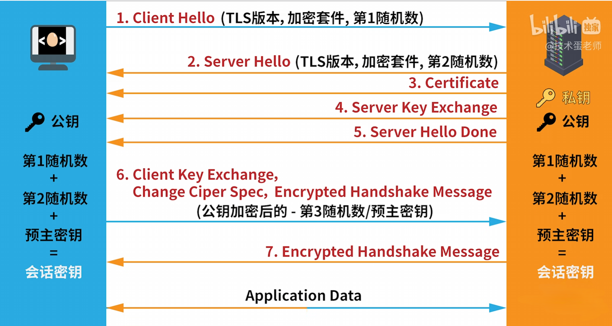

## 前言

关于 HTTP/HTTPS 的笔记。

希望这些笔记不仅能帮助自己系统梳理知识，也能为其他学习计算机网络的朋友提供借鉴。

PS 不定时更新，欢迎讨论区留言。

## HTTP 是什么？

HTTP 是一个在计算机世界里专门在【两点】之间【传输】文字、图片、音频、视频等【超文本】数据的【约定和规范】。

## 常见的 HTTP 状态码

HTTP 状态码通常分为五大类：1xx、2xx、3xx、4xx 和 5xx，每一类代表一种响应类别。以下是一些常见的状态码：

### 1xx（信息性状态码）

- **100 Continue**：继续发送请求的剩余部分。
- **101 Switching Protocols**：服务器正在根据客户端的请求切换协议。

### 2xx（成功状态码）

- **200 OK**：请求成功，服务器返回请求的数据。
- **201 Created**：请求成功，服务器创建了新的资源。
- **202 Accepted**：请求已接受，但处理尚未完成。
- **204 No Content**：请求成功，但没有内容返回。

### 3xx（重定向状态码）

- **301 Moved Permanently**：请求的资源已被永久移动到新位置。
- **302 Found**：请求的资源临时从不同的 URI 响应。
- **304 Not Modified**：资源未修改，客户端可继续使用缓存的版本。

### 4xx（客户端错误状态码）

- **400 Bad Request**：请求语法错误，服务器无法理解。
- **401 Unauthorized**：请求要求身份验证。
- **403 Forbidden**：服务器拒绝请求。
- **404 Not Found**：请求的资源不存在。
- **405 Method Not Allowed**：请求方法不被允许。
- **408 Request Timeout**：请求超时。

### 5xx（服务器错误状态码）

- **500 Internal Server Error**：服务器内部错误，无法完成请求。
- **501 Not Implemented**：服务器不支持请求的功能。
- **502 Bad Gateway**：作为网关或代理的服务器从上游服务器接收到无效响应。
- **503 Service Unavailable**：服务器当前无法处理请求，通常是由于过载或维护。
- **504 Gateway Timeout**：网关或代理服务器未及时从上游服务器收到响应。

## GET 与 POST

GET 的语义是请求获取指定的资源。GET 方法是安全、幂等、可被缓存的。

POST 的语义是根据请求负荷（报文主体）对指定的资源做出处理，具体的处理方式视资源类型而不同。POST 不安全，不幂等，（大部分实现）不可缓存。

## HTTP 各个版本比较

HTTP（超文本传输协议）是 Web 通信的基础协议，随着互联网的发展，HTTP 协议经过多次演变。本文档将介绍常见的 HTTP 版本及其主要特性和区别。

### HTTP/0.9

- **简介**：是 HTTP 最早的版本，设计非常简单。
- **特点**：
  - 只支持 GET 方法。
  - 不支持消息头和状态码。
  - 主要用于获取简单的 HTML 文件。
- **限制**：功能非常受限，无法应对复杂的需求，如状态管理或内容协商。

### HTTP/1.0

- **简介**：HTTP/1.0 在 1996 年作为 RFC 1945 发布，是对 HTTP/0.9 的扩展。
- **特点**：
  - 支持多种请求方法，如 GET、POST、HEAD。
  - 引入了状态码和响应头，使得响应内容更加丰富。
  - 每个请求后通常会关闭连接（非持久连接）。
- **限制**：
  - 每次请求都需建立新的 TCP 连接，导致效率较低。
  - 不支持持久连接，无法处理多个请求。

### HTTP/1.1

- **简介**：HTTP/1.1 在 1997 年发布（RFC 2068），经过多次修订，是目前应用最广泛的版本。
- **特点**：
  - 支持持久连接（Connection: keep-alive），可以在同一连接上发送多个请求。
  - 支持分块传输编码（chunked transfer encoding），使得数据流能够动态生成。
  - 引入了更多的请求方法和头部字段，如 OPTIONS、PUT、DELETE 等。
  - 支持管道化（pipelining），即可在同一个 TCP 连接里面，客户端可以发起多个请求，只要第一个请求发出去了，不必等其回来，就可以发第二个请求出去，可以减少整体响应时间。但是服务器必须按照接收请求的顺序发送对这些管道化请求的响应，如果服务端在处理 A 请求时耗时比较长，那么后续的请求的处理都会被阻塞住，这称为「队头堵塞」，所以，HTTP/1.1 管道解决了请求的队头阻塞，但是没有解决响应的队头阻塞。
- **改进**：相比于 HTTP/1.0, 在性能和灵活性上都有显著提升。

### HTTP/2

- **简介**：HTTP/2 在 2015 年作为 RFC 7540 发布，主要目标是提高性能和减少延迟。
- **特点**：

  - 基于二进制协议而不是文本协议，提高了解析效率和可靠性。
  - 支持多路复用（multiplexing），在单一 TCP 连接内同时发送多个请求和响应，减少了连接建立的开销。
  - 使用头部压缩（HPACK：在客户端和服务器同时维护一张头信息表，所有字段都会存入这个表，生成一个索引号，以后就不发送同样字段了，只发送索引号，这样就提高速度了），降低请求和响应头的传输量。
  - 支持服务器推送（Server Push），服务器可以主动推送资源到客户端，以减少等待时间。

    HTTP/2 通过 Stream 的并发能力，解决了 HTTP/1 队头阻塞的问题，看似很完美了，但是 HTTP/2 还是存在“队头阻塞”的问题，只不过问题不是在 HTTP 这一层面，而在 TCP 这一层。HTTP/2 是基于 TCP 协议来传输数据的，TCP 是字节流协议，TCP 层必须保证收到的字节数据是完整且连续的，这样内核才会将缓冲区里的数据返回给 HTTP 应用，那么当「前 1 个字节数据」没有到达时，后收到的字节数据只能存放在内核缓冲区里，只有等到这 1 个字节数据到达时，HTTP/2 应用层才能从内核中拿到数据，这就是 HTTP/2 队头阻塞问题。

### HTTP/3

- **简介**：HTTP/3 是 HTTP 协议的最新版本，目前处于快速发展阶段。HTTP/3 基于 QUIC 协议构建。

  HTTP/1.1 中的管道(pipeline)虽然解决了请求的队头阻塞，但是没有解决响应的队头阻塞，因为服务端需要按顺序响应收到的请求，如果服务端处理某个请求消耗的时间比较长，那么只能等响应完这个请求后，才能处理下一个请求，这属于 HTTP 层队头阻塞。HTTP/2 虽然通过多个请求复用一个 TCP 连接解决了 HTTP 的队头阻塞 ，但是一旦发生丢包，就会阻塞住所有的 HTTP 请求，这属于 TCP 层队头阻塞。HTTP/2 队头阻塞的问题是因为 TCP，所以 HTTP/3 把 HTTP 下层的 TCP 协议改成了 UDP!

- **特点**：
  - 使用 QUIC 传输协议，基于 UDP 而非传统的 TCP。QUIC 结合了 TLS/SSL 加密功能，从而提高了安全性和连接建立速度。
  - 支持多路复用，不存在 TCP 队头阻塞问题，即使某个流遇到问题也不会影响其他流。
  - 连接恢复更快：在网络环境变化时（如网络切换），HTTP/3 能够更好地保持会话连续性。
- **改进**：
  - 提供了更低的延迟、更快的连接建立速度以及更加可靠的传输体验。

### 总结

| HTTP 版本    | 特点或改进                                                                               |
| ------------ | ---------------------------------------------------------------------------------------- |
| **HTTP/0.9** | 最基础，仅支持 GET 请求，功能极其简单。                                                  |
| **HTTP/1.0** | 引入状态码和头部，但每次请求都关闭连接。                                                 |
| **HTTP/1.1** | 支持持久连接和多种请求方法，大大提高了传输效率。                                         |
| **HTTP/2**   | 通过二进制传输、多路复用、头部压缩和服务器推送等特性进一步提升性能。                     |
| **HTTP/3**   | 采用 QUIC 协议，改善了连接建立和多路复用的性能，尤其在高延迟或不稳定网络环境下表现优异。 |

## HTTP 与 HTTPS

HTTP（超文本传输协议）和 HTTPS（安全超文本传输协议）是用于客户端与服务器之间通信的两种协议。它们在功能上相似，但在安全性和数据传输方式上存在重要区别。

### HTTP

- **定义**：HTTP 是一种无状态、无连接的应用层协议，用于传输超文本（如 HTML）。
- **特点**：
  - **无加密**：数据以明文形式传输，易受到窃听和中间人攻击。
  - **端口**：默认使用 80 端口。
  - **性能**：由于传输简单，开销较小，但安全性不足。
- **适用场景**：适用于对数据安全性要求不高的场景或内部网络环境中。

### HTTPS

- **定义**：HTTPS 是基于 HTTP 协议并结合 TLS/SSL 加密层的安全传输协议。
- **特点**：
  - **加密传输**：通过 TLS/SSL 对数据进行加密，保护数据传输过程中不被窃取或篡改。
  - **身份验证**：服务器需要通过数字证书进行身份验证，增强了信任度。
  - **数据完整性**：提供数据完整性校验，可以检测数据在传输中的任何异常修改。
  - **端口**：默认使用 443 端口。
- **适用场景**：适用于要求高安全性的数据传输场景，如电子商务、在线银行、用户登录等。

### HTTP 与 HTTPS 的比较

| 特性       | HTTP                                         | HTTPS                                                     |
| ---------- | -------------------------------------------- | --------------------------------------------------------- |
| 加密       | 无加密，数据明文传输                         | 使用 TLS/SSL 加密，保障数据安全                           |
| 默认端口   | 80                                           | 443                                                       |
| 数据安全性 | 低，易受中间人攻击和窃听                     | 高，数据在传输过程中受到保护                              |
| 网站信任度 | 通常用于公开信息传输，可以用在内容分发等场景 | 增强了用户信任，搜索引擎排名也通常给予 HTTPS 网站更多优势 |
| 实施成本   | 实现简单，无需额外配置                       | 需要购买或申请 TLS/SSL 证书，配置相对复杂                 |

### TLS 握手的简单描述

[blibli 技术蛋老师 https 视频](https://www.bilibili.com/video/BV1KY411x7Jp/?share_source=copy_web&vd_source=3b63c0fccbecf1d3b621910b49a7a8b3 "blibli 技术蛋老师https视频")

1. **ClientHello**

   - 客户端发起连接，发送 `ClientHello` 消息。
   - 消息中包含客户端支持的 TLS 版本、加密套件以及一个随机数（Client Random）。

2. **ServerHello 与服务器认证**

   - 服务器收到 `ClientHello` 后，回复 `ServerHello` 消息，确认 TLS 版本和加密套件，并提供自己的随机数（Server Random）。
   - 同时，服务器发送数字证书（Certificate），用于证明其身份（可选：还会发送密钥交换参数）。

3. **ClientKeyExchange**

   - 客户端验证服务器的证书后，生成一个预主密钥，并使用服务器的公钥对其进行加密后发送给服务器。
   - 双方利用预主密钥以及交换的随机数计算出对称加密会话密钥。

4. **Finished**
   - 双方分别发送 `Finished` 消息。这些消息包含双方所有握手数据的摘要，用于验证握手过程的完整性。
   - 握手完成后，后续的通信将使用协商的对称密钥加密传输数据。

### HTTPS 中对称加密与非对称加密的简单描述（解决窃听风险）

HTTPS 通过结合使用非对称加密和对称加密来确保通信的安全性。下面简单描述这两种加密方式在 HTTPS 中的作用：

- **非对称加密**：

  - 使用公钥和私钥进行加密和解密。
  - 在 TLS 握手阶段，客户端使用服务器的公钥加密预主密钥，服务器使用私钥来解密，从而安全地交换密钥。
  - 主要用于身份验证和密钥交换，虽然安全性高，但计算较慢。

- **对称加密**：
  - 使用相同的密钥进行加密和解密。
  - TLS 握手完成后，客户端和服务器使用协商好的会话密钥对数据进行加密传输。
  - 速度快，适用于大量数据的加密，但依赖密钥的安全交换。

### HTTPS 中的摘要算法与数字签名的简单描述（解决篡改风险）

- **摘要算法**：  
  将任意长度的数据转换为固定长度的哈希值（或称消息摘要），其关键特点是单向性不可逆。

  - **作用**：用于检测数据在传输过程中是否被篡改。
  - **常见算法**：例如 SHA-256，适用于确保数据完整性。

- **数字签名**：  
  结合摘要算法与非对称加密技术，实现对数据来源和完整性的验证。

  公钥加密，私钥解密。这个目的是为了保证内容传输的安全，因为被公钥加密的内容，其他人是无法解
  密的，只有持有私钥的人，才能解密出实际的内容;

  私钥加密，公钥解密。这个目的是为了保证消息不会被冒充，因为私钥是不可泄露的，如果公钥能正常
  解密出私钥加密的内容，就能证明这个消息是来源于持有私钥身份的人发送的。

  - **过程**：先对数据使用摘要算法生成哈希值，然后使用发送方的私钥对该哈希值进行加密，从而得到数字签名；接收方使用发送方的公钥解密签名，并与自己计算的哈希值进行比对。
  - **作用**：验证数据的真实性及防止数据被篡改。

### HTTPS 数字证书的简单描述（解决冒充风险）

HTTPS 数字证书是保障互联网通信安全的重要组成部分，用于验证服务器的身份并确保数据传输过程中的加密通信安全。

数字证书是一种电子文档，其中包含以下信息：

- **持有者信息**：如服务器的名称、域名及其他标识信息。
- **公钥**：用于加密数据或验证数字签名的公钥。
- **颁发机构信息**：数字证书由受信任的第三方（称为证书颁发机构，CA）签发，确保证书的真实性。
- **有效期**：证书的开始日期和截止日期。
- **数字签名**：由证书颁发机构使用其私钥生成的签名，用于验证证书内容是否被篡改。

通过数字证书的方式保证服务器公钥的身份，解决冒充的风险。

### HTTPS 是否可能被中间人截获？

HTTPS 设计的主要目标之一是防止中间人攻击（MITM）。通过使用 TLS/SSL 加密，HTTPS 确保了通信双方之间的数据在传输过程中是加密的，任何试图拦截的数据都难以解密或篡改。

1. **证书验证与信任链**

   - 浏览器和客户端会验证服务器提供的数字证书，确保其由受信任的证书颁发机构（CA）签发。如果验证通过，客户端就会信任与服务器的连接。
   - 如果攻击者能够伪造有效的证书或成功欺骗客户端（例如通过用户忽略警告），才有可能进行中间人攻击。

2. **加密保护**

   - 正确配置和使用 HTTPS 时，即使数据被中间人拦截，由于数据是加密的，攻击者也无法轻易解密和修改数据。

3. **潜在风险**
   - 配置错误：如果服务器使用了弱加密算法、过期或错误配置的证书，可能会降低安全性，使攻击者有机可乘。
   - CA 安全问题：一旦证书颁发机构（CA）受到攻击或存在漏洞，攻击者也可能利用伪造证书进行攻击。

### HTTPS 中 RSA 与 ECDHE 简单比较

下表简单对比了 HTTPS 中使用的 RSA 与 ECDHE 两种密钥交换方式的主要区别：

| 方面         | RSA                                        | ECDHE                                    |
| ------------ | ------------------------------------------ | ---------------------------------------- |
| 密钥交换方式 | 用 RSA 公钥加密预主密钥                    | 基于椭圆曲线 Diffie-Hellman 临时密钥交换 |
| 前向保密性   | 无前向保密性；私钥泄露可能导致历史会话泄密 | 提供前向保密性；每次会话生成新的临时密钥 |
| 计算效率     | 依赖较长密钥，加密解密计算量大             | 密钥较短，计算更高效                     |
| 安全性       | 基于大数分解难题，量子计算威胁较高         | 基于椭圆曲线离散对数问题，安全性更好     |

### HTTP/1.1 优化思路？

1. 通过缓存技术来避免发送 HTTP 请求。客户端收到第一个请求的响应后，可以将其缓存在本地磁盘，下次请求的时候，如果缓存没过期，就直接读取本地缓存的响应数据。如果缓存过期，客户端发送请求的时候带上响应数据的摘要，服务器比对后发现资源没有变化，就发出不带包体的 304 响应，告诉客户端缓存的响应仍然有效。
2. 第二个思路是，减少 HTTP 请求的次数，有以下的方法:

   - 将原本由客户端处理的重定向请求，交给代理服务器处理，这样可以减少重定向请求的次数。
   - 将多个小资源合并成一个大资源再传输，能够减少 HTTP 请求次数以及 头部的重复传输，再来减少 TCP 连接数量，进而省去 TCP 握手和慢启动的网络消耗。
   - 按需访问资源，只访问当前用户看得到/用得到的资源，当客户往下滑动，再访问接下来的资源，以此达到延迟请求，也就减少了同一时间的 HTTP 请求次数。

3. 通过压缩响应资源，降低传输资源的大小，从而提高传输效率，所以应当选择更优秀的压缩算法。

### 为什么需要 WebSocket？

虽然 HTTP 协议已经在互联网应用中得到了广泛使用，但其设计理念是基于请求-响应模型，适合单向通信，即客户端发起请求，服务器返回响应。这种模型存在以下局限性：

- **无状态连接**：HTTP 是无状态的，每次请求都要重新建立连接，无法直接保持长时间的双向通信。
- **单向通信**：服务器不能主动向客户端推送数据，所有通信都必须由客户端发起请求。
- **高延迟**：频繁建立和断开连接会带来额外的延迟和资源开销，尤其在实时应用场景下不够高效。

为了解决这些局限性，WebSocket 协议应运而生，其主要优势包括：

1. **双向通信**

   - WebSocket 建立了一个持久连接，允许数据在客户端和服务器之间双向实时传输，不需要每次都重新建立连接。

2. **低延迟**

   - 一旦建立连接，数据交换无需重复 HTTP 请求头，降低了通信延迟，适合要求实时更新的应用场景，如在线游戏、金融交易、聊天应用等。

3. **更高效的资源利用**

   - 持久连接减少了频繁的连接建立和关闭开销，有助于减轻服务器压力，同时也降低了网络带宽消耗。

4. **更灵活的应用场景**
   - WebSocket 可以实现实时数据推送，服务器可以主动发送数据给客户端，非常适合实现实时监控、协同编辑等需要快速交互的应用。
