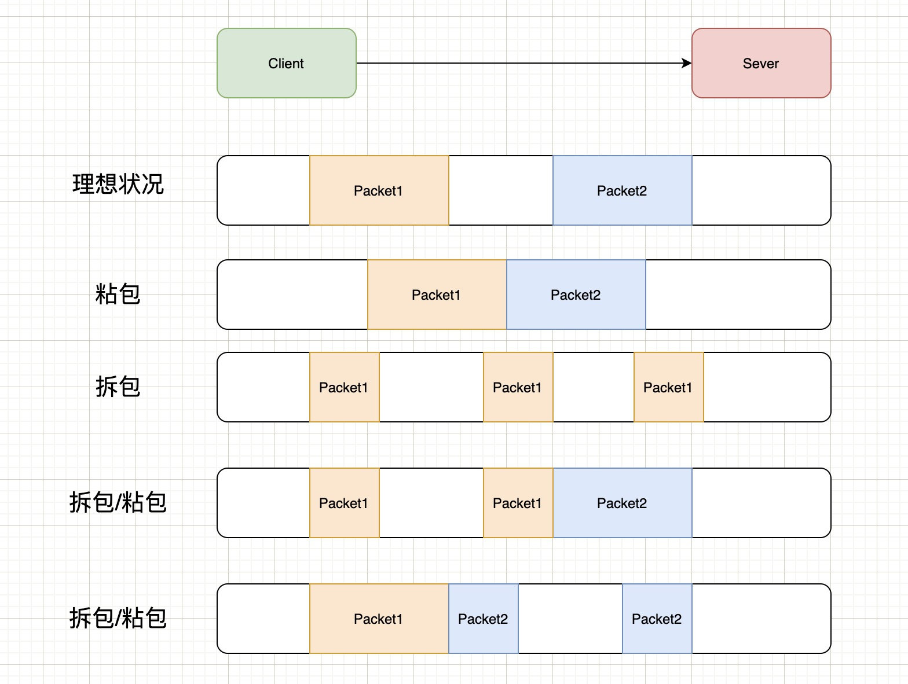

## 前言

关于 TCP/UDP 的笔记。

希望这些笔记不仅能帮助自己系统梳理知识，也能为其他学习计算机网络的朋友提供借鉴。

PS 不定时更新，欢迎讨论区留言。

## 什么是 TCP？

TCP 是⾯向连接的、可靠的、基于字节流的传输层通信协议。

1. **面向连接**  
   在发送数据之前，通信双方会先通过一个称为“三次握手”（3-way handshake）的过程建立一条可靠的传输连接。只有连接建立完成后，数据传输才能开始。是一对一的，不能像 UDP 一样一对多。

2. **可靠传输**  
   TCP 使用数据确认（ACK）、超时重传、重复确认（Duplicate ACK）等机制，确保数据包能够按顺序、完整地到达接收端。如果发生数据丢失或出错，TCP 能够自动进行重传，保证传输的可靠性。

3. **面向字节流**  
   TCP 将数据视为连续的字节流，而不是独立的数据包。这意味着在应用层数据的边界需要进行额外管理，例如通过消息分隔符或固定长度来标识每个独立的消息。

## TCP 与 UDP 对比表

| **方面**       | **TCP**                                                                            | **UDP**                                                                                      |
| -------------- | ---------------------------------------------------------------------------------- | -------------------------------------------------------------------------------------------- |
| 面向连接       | 是，需要建立连接（三次握手）后才能进行数据传输                                     | 否，无连接，数据直接发送                                                                     |
| 数据可靠性     | 高，具备数据确认、重传机制、累积确认和错误校验等措施，确保数据准确无误到达         | 低，无内建确认和重传机制，数据可能丢失或乱序                                                 |
| 数据顺序       | 保证按发送顺序到达                                                                 | 不保证顺序，数据包独立传输                                                                   |
| 流量控制       | 采用滑动窗口机制，根据接收方缓冲区大小动态控制数据发送速率                         | 无，发送数据完全由应用层控制，可能导致接收端被淹没                                           |
| 拥塞控制       | 有，使用慢启动、拥塞避免、快速重传与快速恢复等算法，动态调整发送速率以应对网络拥塞 | 无，不具备拥塞控制，可能在网络繁忙时频繁丢包                                                 |
| 错误检测与恢复 | 有，通过校验和及确认机制检测错误，并通过重传恢复丢失的数据                         | 仅有基本的校验和，不能进行错误恢复                                                           |
| 头部开销       | 较大，TCP 头部通常为 20 字节或以上，包含丰富的控制信息                             | 较小，仅 8 字节，结构简单                                                                    |
| 连接管理       | 复杂，需经过三次握手建立连接及四次挥手断开连接，带来额外延时和资源开销             | 简单，无需连接建立和断开，适用于快速传输                                                     |
| 实时性         | 相对较低，其可靠性保障和拥塞控制可能导致延迟上升，通常不适用于对延迟极度敏感的场景 | 高，延迟低，适合实时视频、在线游戏、VoIP 等对时效性要求较高的应用                            |
| 适用场景       | 文件传输、网页浏览、电子邮件、数据库通信等需要高可靠性和数据顺序保证的应用         | 实时通讯、视频会议、在线游戏、DNS 查询、流媒体传输等可以容忍部分数据丢失，但要求低延迟的场景 |

## TCP 和 UDP 可以使⽤同⼀个端⼝吗？

可以的。

在数据链路层中，通过 MAC 地址来寻找局域网中的主机。在网际层中，通过 IP 地址来寻找网络中互连的主机或路由器。在传输层中，需要通过端口进行寻址，来识别同一计算机中同时通信的不同应用程序。

所以，传输层的「端口号」的作用，是为了区分同一个主机上不同应用程序的数据包。

传输层有两个传输协议分别是 TCP 和 UDP，在内核中是两个完全独立的软件模块。

当主机收到数据包后，可以在 IP 包头的「协议号」字段知道该数据包是 TCP/UDP，所以可以根据这个信息确定送给哪个模块（TCP/UDP）处理，送给 TCP/UDP 模块的报文根据「端口号」确定送给哪个应用程序处理。

## 序列号(SEQ)和初始序列号(ISN)

序列号，是 TCP 一个头部字段，标识了 TCP 发送端到 TCP 接收端的数据流的一个字节，因为 TCP
是面向字节流的可靠协议，为了保证消息的顺序性和可靠性，TCP 为每个传输方向上的每个字节都赋
予了一个编号，以便于传输成功后确认、丢失后重传以及在接收端保证不会乱序。序列号是一个 32
位的无符号数，因此在到达 4G 之后再循环回到 0。

初始序列号，在 TCP 建立连接的时候，客户端和服务端都会各自生成一个初始序列号，它是基于时
钟生成的一个随机数，来保证每个连接都拥有不同的初始序列号。初始化序列号可被视为一个 32 位
的计数器，该计数器的数值每 4 微秒加 1，循环一次需要 4.55 小时。

## TCP 三次握手过程

TCP 三次握手（Three-Way Handshake）是建立一个可靠的 TCP 连接的过程，通过交换控制信息来初始化连接参数。下面是详细的步骤：

1. **第一次握手（SYN）**

   - 客户端向服务器发送一个带有 SYN 标志的报文段，该报文段包含客户端选择的初始序列号（ISN）。
   - 该报文段表示客户端希望与服务器建立连接。
   - 表示形式：
     ```
     客户端 → 服务器: SYN, Seq = x
     ```

2. **第二次握手（SYN-ACK）**

   - 服务器收到客户端的 SYN 后，发送一个包含 SYN 和 ACK 标志的报文段给客户端。
   - 该报文段中，ACK 用来确认收到客户端的 SYN（Ack = x + 1），同时服务器也选择一个初始序列号（ISN = y）来建立自己的连接参数。
   - 表示形式：
     ```
     服务器 → 客户端: SYN, ACK, Seq = y, Ack = x + 1
     ```

3. **第三次握手（ACK）**
   - 客户端在收到服务器的 SYN-ACK 后，再发送一个只带 ACK 标志的报文段，作为对服务器响应的确认。
   - 该报文段中的 ACK 用来确认收到服务器的 SYN（Ack = y + 1）。
   - 表示形式：
     ```
     客户端 → 服务器: ACK, Seq = x + 1, Ack = y + 1
     ```

当服务器收到这个 ACK 后，双方就建立了一个可靠的 TCP 连接，可以进行后续数据传输了。

## 为什么需要三次握手，而不是两次或四次？

「两次握⼿」：⽆法防⽌历史连接的建⽴，会造成双方资源的浪费，也⽆法可靠的同步双⽅序列号。

「四次握⼿」：三次握⼿就已经理论上最少可靠连接建⽴，所以不需要使⽤更多的通信次数。

## TCP 握手丢失情况

### TCP 第一次握手丢失的情况

当第一次握手丢失时，TCP 将通过重传策略来尝试恢复连接，但如果问题持续存在，连接将建立失败并反馈错误信息给应用程序。

### TCP 第二次握手丢失的情况

当第二次握手丢失了，客户端和服务端都会重传。

- 客户端会重传 SYN 报文，也就是第一次握手，最大重传次数由内核参数决定。

- 服务端会重传 SYN-ACK 报文，也就是第二次握手，最大重传次数由内核参数决定。

### TCP 第三次握手丢失的情况

ACK 报文是不会有重传的，当 ACK 丢失了，就由对方重传对应的报文。直到收到第三次握⼿，或者达到最⼤重传次数。

## TCP 四次挥手过程

1. **第一次挥手（FIN）**

   - 客户端在没有数据发送后，向服务器发送一个带有 FIN 标志的报文段，以指示客户端不再有数据要发送。
   - 表示形式：
     ```
     客户端 → 服务器: FIN, Seq = u
     ```

2. **第二次挥手（ACK）**

   - 服务器收到客户端的 FIN 报文段后，立即发送一个 ACK 报文段作为确认，表明已接收到客户端停止发送数据的请求。
   - 表示形式：
     ```
     服务器 → 客户端: ACK, Seq = v, Ack = u + 1
     ```
   - 此时，服务器可能仍有未传输完的数据，故数据传输方向上尚未完全关闭。

3. **第三次挥手（FIN）**

   - 当服务器完成剩余数据的传输后，会向客户端发送一个带有 FIN 标志的报文段，通知客户端服务器也没有数据要发送了，准备关闭连接。
   - 表示形式：
     ```
     服务器 → 客户端: FIN, Seq = w
     ```

4. **第四次挥手（ACK）**
   - 客户端收到服务器的 FIN 报文段后，发送一个 ACK 报文段以确认收到服务器关闭连接的请求。
   - 表示形式：
     ```
     客户端 → 服务器: ACK, Seq = u + 1, Ack = w + 1
     ```

## 为什么 TCP 挥手需要四次？

TCP 使用四次挥手断开连接，主要原因在于 TCP 连接是全双工的，也就是数据传输在两个方向上是独立的。在断开连接时，每个方向的数据传输都需要单独关闭。下面详细解释这一过程以及四次挥手的必要性：

1. **单向关闭**

   - 当一方准备结束数据发送时，它只关闭自己的发送通道，但仍可接收数据。
   - 例如，当客户端发送一个 FIN 时，它表示自己没有数据要发送了，但仍然可以接收服务器的数据。

2. **独立的确认**

   - 对于第一次 FIN（例如客户端发送的 FIN），服务器需要发送一个 ACK 来确认已经收到关闭请求。这只是对单个方向（客户端到服务器）的关闭确认。
   - 接下来，服务器完成自身数据发送后，也需要发送 FIN 来关闭其发送通道，客户端再对其进行确认。

3. **为何需要四次**

   - 第一步（客户端 FIN）：客户端通知服务器“我已经没有数据要发送了”。
   - 第二步（服务器 ACK）：服务器确认客户端的 FIN，并告知已接收，但此时仍可继续发送数据给客户端。
   - 第三步（服务器 FIN）：当服务器也结束发送数据后，它通知客户端“我也没有数据要发送了”。
   - 第四步（客户端 ACK）：客户端确认服务器的关闭请求，整个连接才能完全关闭。

4. **可靠的连接终止**
   - 四次挥手确保了双方在断开连接前都能完成数据传输与确认，避免数据丢失。
   - 这种设计使得双方可以独立地结束各自的数据传输，从而达到安全、可靠地断开连接的目的。

## 什么情况会出现三次挥手？

当被动关闭方在 TCP 挥手过程中，如果「没有数据要发送」，同时「没有开启 TCP_QUICKACK(默认情
况就是没有开启，没有开启 TCP_QUICKACK，等于就是在使用 TCP 延迟确认机制)」，那么第二和第三
次挥手就会合并传输，这样就出现了三次挥手。

## TCP 挥手丢失情况

### TCP 第一次挥手丢失的情况

当 TCP 第一次挥手的 FIN 报文丢失时，连接不会被立即关闭。主动关闭方会依赖重传机制来确保 FIN 最终传达到对方，一旦双方完成重传和确认，连接才会进入正常的终止流程。

### TCP 第二次挥手丢失的情况

ACK 报文是不会重传的，所以如果服务端的第二次挥手丢失了，客户端就会触发超时重传机制，重传 FIN 报文，直到收到服务端的第二次挥手，或者达到最大的重传次数。

### TCP 第三次挥手丢失的情况

当服务端重传第三次挥手报文的次数达到了 3 次后，由于 tcp_orphan_retries 为 3，达到了重传最大次数，于是再等待一段时间(时间为上一次超时时间的 2 倍)，如果还是没能收到客户端的第四次挥手(ACK 报文)，那么服务端就会断开连接。

客户端因为是通过 close 函数关闭连接的，处于 FIN WAIT 2 状态是有时长限制的，如果 tcp_fin_timeout 时间内还是没能收到服务端的第三次挥手(FIN 报文)，那么客户端就会断开连接。

### TCP 第四次挥手丢失的情况

当服务端重传第三次挥手报文达到 2 时，由于 tcp_orphan_retries 为 2，达到了最大重传次数，于是再等待一段时间(时间为上一次超时时间的 2 倍)，如果还是没能收到客户端的第四次挥手(ACK 报文)，那么服务端就会断开连接。

客户端在收到第三次挥手后，就会进入 TIME WAIT 状态，开启时长为 2MSL 的定时器，如果途中再次收到第三次挥手(FIN 报文)后，就会重置定时器，当等待 2MSL 时长后，客户端就会断开连接。

## 为什么需要 TIME_WAIT 状态？

防止历史连接中的数据，被后面相同四元组的连接错误的接收。

保证「被动关闭连接」的一方，能被正确的关闭。

## 为什么每次建立 TCP 连接时，初始化的序列号都要求不一样？

1. **防止旧数据干扰**  
   如果使用固定或者可预测的序列号，网络中可能还残留有上一次连接的数据包，在新连接建立后，这些旧数据包可能会被误认为是当前连接的数据，从而导致数据混乱或连接异常。选择唯一的 ISN 可以避免这种数据干扰问题。

2. **确保数据流正确排序**  
   TCP 是一个面向字节流的协议，双方通过序列号来组织和排序数据。当每次连接的序列号都不相同时，可以确保即使出现重传或者网络延迟，接收方也能正确地将数据包按正确的顺序进行排序和重组。

3. **增强安全性**  
   可预测的序列号可能给攻击者提供利用的机会，例如 TCP 序列号预测攻击。因此，每次连接都使用一个不容易预测的初始序列号，可以有效提升连接的安全性，降低恶意攻击的风险。

4. **区分不同连接**  
   在同一对主机之间可能会在短时间内建立多个 TCP 连接。通过为每个连接选择不同的 ISN，可以帮助系统区分并管理这些连接，防止连接状态混淆。

## 什么是 MTU

最大传输单元（英语：Maximum Transmission Unit，缩写 MTU）是指数据链路层上面所能通过的最大数据包大小（以字节为单位）。

## 什么是 MSS？

最大分段大小（Maximum Segment Size）是传输控制协议的一个参数，以字节数定义一个计算机或通信设备所能接受的分段的最大数据量。 它并不会计算 TCP 或 IP 协议头的大小。即最大传输单元除去信头后的最大数据量。

## 为什么 TCP 层需要 MSS？

1. **降低 IP 分片的开销和风险**

   - **分片开销**：IP 分片不仅增加了每个数据包在网络上传输时的负担，还会影响路由器和接收主机的处理效率。每个分片都需要单独处理，如果分片过多，会导致额外的延时和资源消耗。
   - **分片丢失问题**：如果 IP 分片中的任一碎片丢失，整个数据包都必须重新传输。而且某些网络设备可能不支持 IP 分片或安全策略会丢弃分片，导致传输失败。

2. **提高传输效率与可靠性**

   - **匹配底层网络 MTU**：TCP 在连接建立时协商并计算对端的 MSS，通常依据路径 MTU（Path MTU）来计算。这样可以确保 TCP 报文段在封装进 IP 数据报之后，不会超出最低链路的 MTU，从而避免触发 IP 分片。
   - **优化数据传输**：合理的 MSS 可以使得每个 TCP 报文段刚好适应底层网络的 MTU，最大限度地利用网络带宽，确保传输的连续性和高效性。

3. **简化错误处理**

   - 使用 MSS 限制 TCP 报文段大小可以降低由于 IP 分片引起的重传和错误处理的复杂度。如果发生数据丢失，整个 TCP 报文段丢失时，只需要重传一个比较小的单元，而不是一个由多个分片组成的大数据包。

4. **协商与兼容性**
   - 在 TCP 三次握手过程中，双方会交换 MSS 值，明确双方所能接受的最大报文段大小。这种协商有助于两端在一个共同的限制下进行通信，从而确保数据传输更加稳定和兼容不同网络环境。

## TCP 的粘包、拆包以及解决方案



上图中演示了以下几种情况：

- 正常的理想情况，两个包恰好满足 TCP 缓冲区的大小或达到 TCP 等待时长，分别发送两个包；
- 粘包：两个包较小，间隔时间短，发生粘包，合并成一个包发送；
- 拆包：一个包过大，超过缓存区大小，拆分成两个或多个包发送；
- 拆包和粘包：Packet1 过大，进行了拆包处理，而拆出去的一部分又与 Packet2 进行粘包处理。

### 什么是粘包？

指 TCP 协议中，发送方发送的若干包数据到接收方接收时粘成一包，从接收缓冲区看，后一包数据的头紧接着前一包数据的尾。

TCP 是面向字节流的协议，就是没有界限的一串数据，本没有“包”的概念，“粘包”和“拆包”一说是为了有助于形象地理解这两种现象。

### 为什么 UDP 没有粘包？

粘包拆包问题在数据链路层、网络层以及传输层都有可能发生。日常的网络应用开发大都在传输层进行，由于 UDP 有消息保护边界，不会发生粘包拆包问题，因此粘包拆包问题只发生在 TCP 协议中。

### 粘包拆包发生场景

因为 TCP 是面向流，没有边界，而操作系统在发送 TCP 数据时，会通过缓冲区来进行优化，例如缓冲区为 1024 个字节大小。

如果一次请求发送的数据量比较小，没达到缓冲区大小，TCP 则会将多个请求合并为同一个请求进行发送，这就形成了粘包问题。

如果一次请求发送的数据量比较大，超过了缓冲区大小，TCP 就会将其拆分为多次发送，这就是拆包。

### 常见的解决方案

- 发送端将每个包都封装成固定的长度，比如 100 字节大小。如果不足 100 字节可通过补 0 或空等进行填充到指定长度；
- 发送端在每个包的末尾使用固定的分隔符，例如\r\n。如果发生拆包需等待多个包发送过来之后再找到其中的\r\n 进行合并；例如，FTP 协议；
- 将消息分为头部和消息体，头部中保存整个消息的长度，只有读取到足够长度的消息之后才算是读到了一个完整的消息；
- 通过自定义协议进行粘包和拆包的处理。
